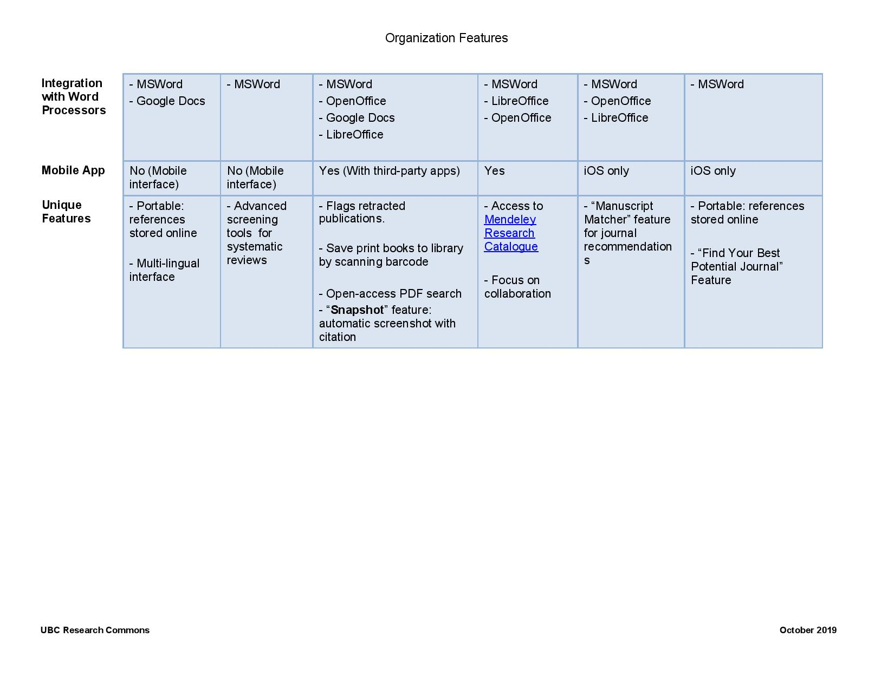

# Organizing and Collaborating

 
## Organization Features
The _Participants_ window lists everyone in the session. Click the icons at the bottom of the window to communicate with the instructors.

Clicking an icon makes it appear next to your name in the participants list. Use this to **answer yes/no** questions or to **raise your hand** when instructors invite you to ask a question, comment, or share your screen.
 
## Collaboration Features

Tables created by Sarah Parker, Reference Librarian, UBC Woodward Library
